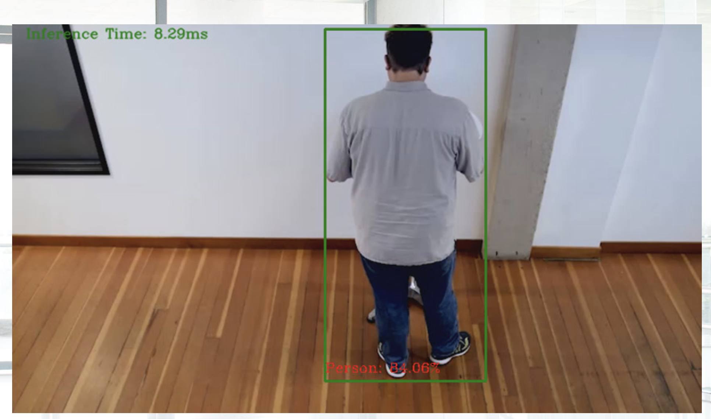
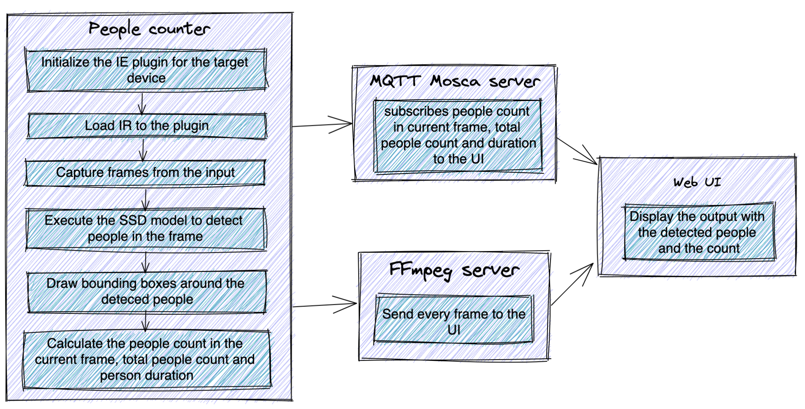
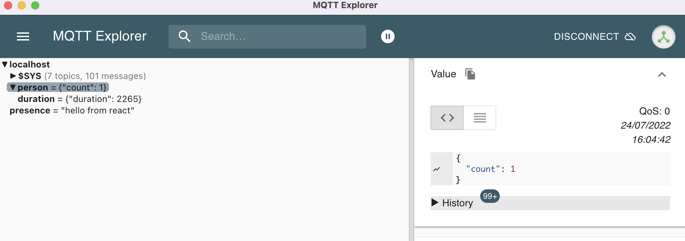

OpenVino Toolkit - Deploy People counter App at the Edge



| Details               |              |
|-----------------------|---------------|
| Programming Language |  Python 3.8 |
|Intel® Distribution of OpenVINO™ toolkit| v2021.4.752 |


<!-- TOC depthFrom:1 orderedList:true -->
# Table of content
- [What it does?](#what-it-does)
- [What is OpenVINO™ Toolkit](#what-is-openvino-toolkit)
- [How it works?](#how-it-works)
- [Run the application](#running-the-code)
- [Where to find the components logs?](#logs)
- [Project writeup](./WRITEUP.md)
- [How to check the MQTT published messages?](#how-to-check-the-mqtt-published-messages)
- [Further readings](#reading)


<a name="#what-it-does"></a>
# What it does?
The people counter application demonstrates how to create a smart video IoT solution using `OpenVINO™ Toolkit`. The app detects people in a designated area, providing the number of people in the frame, average duration of people in frame, and the total count. It also saves a copy of the streamed output and detection results to the local storage device.

A captured video of the people detection can be found [here](./media/FP16_CPU_person-detection-retail-0013.avi)
<a name="#how-it-works"></a>
# How it works?
The application consists of four components that need to run separately:
-  MQTT Mosca server
-  Node.js* Web server
-  FFmpeg server (FFserver)
-  Python backend application using OpenVINO™ Toolkit?




All the needed packages as well as the components are installed within a `Docker image`. That Docker image is using `Intel® Distribution of OpenVINO™ toolkit Docker image for Ubuntu* 20.04 LTS` as a base image.

<a name="#what-is-openvino-toolkit"></a>
## What is OpenVINO™ Toolkit?

OpenVino is a `cross-platform` deep learning toolkit developed by Intel. The name stands for "Open Visual Inference and Neural Network Optimization". It focuses on optimizing neural network inference with a write-once, deploy-anywhere approach for Intel hardware platforms.

<a href="https://docs.openvinotoolkit.org/2021.4/index.html">
    
</a>

<a name="#running-the-code"></a>
# Run the application

1. Build the Docker container
In the top folder run the following command

```bash
 docker build --network=host -t demo .
```

**Note:** To configure the Docker image for GPU, you need to add thne build argument DEVICE as follows

```bash
 docker build --network=host --build-arg DEVICE=GPU -t demo .
```

1. Run the Docker container of the demo
Start the container

```bash
docker run -dit --rm --name demo \
    -p 3000:3000 -p 3002:3002 -p 3004:3004 demo
```
For code debugging you could attash a volume with the code to the container using
```bash
docker run -dit --rm --name demo  -v $PWD:/home/openvino/people-counter \
    -p 3000:3000 -p 3002:3002 -p 3004:3004 demo
```
Run a bash terminal inside the container
```bash
docker exec -it demo bash
```

Then, to run the demo of the application execute the following command within the container bash
```
cd scripts && ./run_demo.sh
```
The web application will be then reachable via `http://localhost:3000/` after a few seconds of running the script

The settings of the demo can be changed by adapting the parameters passed to `main.py` in `run_demo.sh` script. The available options are listed below

```bash
usage: main.py [-h] -m MODEL -i INPUT -n NAME -dt DATA_TYPE [-d DEVICE] [-pt PROB_THRESHOLD] [-db]

optional arguments:
  -h, --help            show this help message and exit
  -m MODEL, --model MODEL
                        Path to an xml file with a trained model.
  -i INPUT, --input INPUT
                        Path to image or video file
  -n NAME, --name NAME  Model name: needed for performance export.
  -dt DATA_TYPE, --data_type DATA_TYPE
                        Floating-point precision e.g. FP32
  -d DEVICE, --device DEVICE
                        Specify the target device to infer on: CPU, GPU, FPGA or MYRIAD is acceptable. Sample will look for a suitable plugin for device specified (CPU by default)
  -pt PROB_THRESHOLD, --prob_threshold PROB_THRESHOLD
                        Probability threshold for detections filtering(0.5 by default)
  -db, --debug          Set to use the app in debug mode.(False by default)
  ```
## Model performance export
The model performance (`.json` file) as well as a video capture of the demo (`.avi` file) are exported to the local folder `perf`. The format of the model performance file looks as below

```json
{
    "Model Name": "person-detection-retail-0013",
    "People count": 30,
    "AVG inference time (sec.)": 0.022,
    "Completion Time (Sec.)": 137.503,
    "Detection confidence threshold (%)": 80.0,
    "Floating-point precision": "FP32"
}
```

# Run the app for various models
 In order to run the application for various models and compare their performance, you execute the script `test_models.sh <DEVICE> <FLOATING_POINT_PRECISION>` located in the top folder of the project. That will execute the app for each of the models listed below and export the corresponding results inside the running container under the folder `/home/openvino/app-artifacts/perf`.

```bash
Usage: ./test_models.sh <DEVICE> [Floating-point precision: FP16|FP32]
 e.g: ./test_models.sh CPU FP16
```
<a name="#logs"></a>
# Where to find the components logs?

The logs of each of the components are available under the folder `logs`

```bash
|____webservice-ui.err
|____mqtt-server.err
|____mqtt-server.out
|____webservice-ui.out
|____ffserver.err
|____people_counter.log
|____ffserver.out
```

<a name="#model"></a>
# Model selection
More details about the project and the model selection can be found [here](./WRITEUP.md)

<a name=#how-to-check-the-mqtt-published-messages></a>
# How to check the MQTT published messages?
To check the `MQTT published messages` you can use [mqtt-explorer](http://mqtt-explorer.com/) tool.

First, you need to run the following commands according to the Operating System you have.
- For MacOS:
```bash
brew install --cask mqtt-explorer
```
- For Ubuntu OS
```bash
sudo apt update
sudo apt install snapd
sudo snap install mqtt-explorer
```
Note: Make sure to have the port number 3002 exposed withing the Docker image. That should also be mapped to the host port number 3002 when running the container `-p 3002:3002`

In `mqtt-explorer` connect the client to `ws://localhost:3002`



<a name="#reading"></a>
# Further readings

- [Overview of the Intel® Distribution of OpenVINO™ Toolkit](https://www.intel.com/content/www/us/en/developer/tools/openvino-toolkit/overview.html)
- [Using OpenVINO with OpenCV](https://learnopencv.com/?s=openvino&id=16719)
- [ffserver](https://trac.ffmpeg.org/wiki/ffserver)